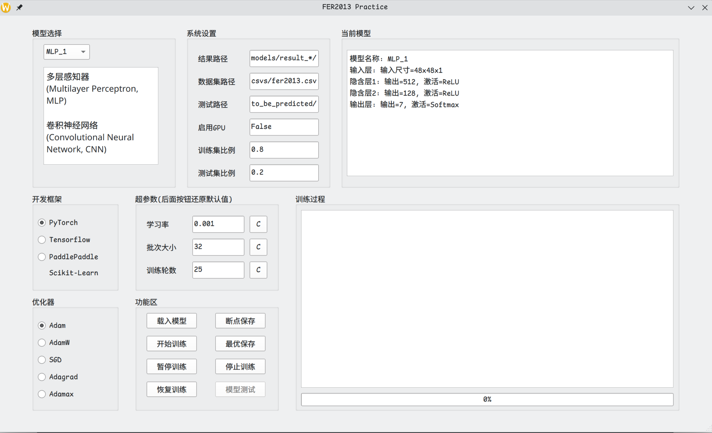
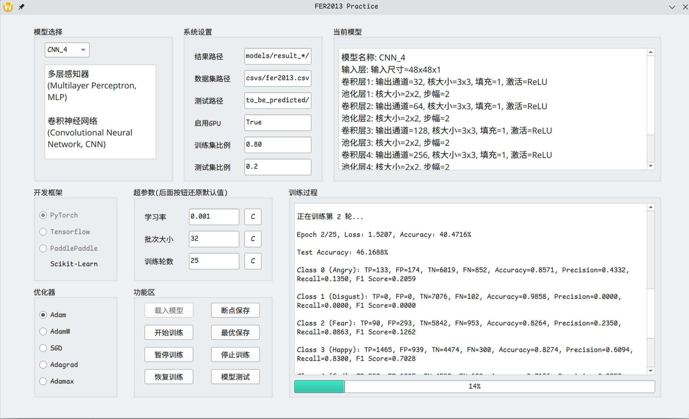

# FER2013训练项目

## 项目简介

本项目使用FER2013数据集进行训练，使用了`Pytorch`、`tensorflow`、`paddlepaddle`框架，实现了多个简单的神经网络模型，用于人脸表情识别。



## 开发环境

- Manjaro Linux KDE Linux 6.12.1-4-MANJARO
- Python 3.11
- Pytorch
- Tensorflow
- PaddlePaddle
- PyQt6
- Visual Studio Code
- Github Copilot

## 项目结构

```
--csvs # 数据集
    |--fer2013.csv
--imgs # README的图片
--models # 模型定义
    |--framework # 框架代码
        |--_pytorch.py
        |--_tensorflow.py
        |--_paddlepaddle.py
    |--models # 模型代码  
        |--_CNN.py
        |--_MLP.py
    |--result_h5 # tensorflow模型保存目录
    |--result_paddle # paddlepaddle模型保存目录
    |--result_pth # pytorch模型保存目录
    |--ROC # ROC曲线保存目录
--ROC # PreTrained.py文件保存ROC曲线的目录
--to_be_predicted # 待预测的图片文件夹
--ui # PyQt6界面代码
    |--fer2013_ui.py
    |--fer2013_ui.ui
--main.py # 主程序
--PreTrained.py # 使用预训练模型的Python程序，独立于主程序
    
```

## 使用前准备

### 安装依赖(以基于archlinux的系统为例)

> 下面的`torchenv`是一个Pytorch环境，可以根据自己的需要更改

```bash
yay -S miniconda3
/opt/miniconda3/bin/conda init zsh
conda create -n torchenv python=3.11 -y
conda activate torchenv
pip install pyqt6-tools pandas numpy tqdm pyinstaller jupyterlab notebook opencv-python scikit-learn matplotlib torch torchvision torchaudio
python3 -c "import torch; print(torch.cuda.is_available())"
```

如果环境为`tensorflow`或`paddlepaddle`，请自行安装对应的环境，从下面的命令中选择对应的`pip`命令

```bash
pip install pyqt6-tools pandas numpy tqdm pyinstaller jupyterlab notebook opencv-python scikit-learn matplotlib 'tensorflow[and-cuda]'

pip install pyqt6-tools pandas numpy tqdm pyinstaller jupyterlab notebook opencv-python scikit-learn matplotlib paddlepaddle-gpu
```

### 下载数据集

从[这里](https://www.kaggle.com/c/challenges-in-representation-learning-facial-expression-recognition-challenge/data)下载FER2013数据集，将`fer2013.csv`放入`csvs`文件夹中

## 预训练模型使用方法

### 使用预训练模型

```bash
conda activate torchenv
python PreTrained.py
```
### 代码说明

`PreTrained.py` 文件使用了预训练的 `ResNet-18` 模型来进行 `FER2013` 数据集的情感分类。以下是代码的主要部分和功能说明：

1. **数据集类**：
   - `FER2013Dataset`：自定义数据集类，用于加载 FER2013 数据集，并根据 `mode` 参数将数据集划分为训练集和测试集。

2. **数据增强和预处理**：
   - `transform_pytorch`：定义了数据增强和预处理操作，包括调整图像尺寸、随机水平翻转、随机旋转、颜色抖动、转换为张量和归一化。

3. **数据加载**：
   - 使用 `DataLoader` 加载训练集和测试集，分别存储在 `train_loader` 和 `test_loader` 中。

4. **预训练模型**：
   - `PretrainedModel`：定义了一个使用预训练 ResNet-18 模型的类，并将输入通道数修改为 1（灰度图像），输出类别数设置为 7（情感类别）。

5. **训练和评估函数**：
   - `train_model`：定义了模型的训练和评估函数，包括训练过程、损失计算、优化器更新、学习率调度、测试集评估、混淆矩阵计算和 ROC 曲线绘制。

6. **模型初始化和训练**：
   - 初始化 `PretrainedModel` 模型，并调用 `train_model` 函数进行训练和评估。

通过运行 `PreTrained.py` 文件，可以使用预训练的 ResNet-18 模型对 FER2013 数据集进行情感分类，并输出训练和测试结果。

## 项目主程序运行方法

> 这里为节省篇幅，不再叙述主程序代码，有需要可以查看项目文件

### 运行主程序

> 请根据自己的环境选择对应的`conda`环境，这里以`torchenv`为例

```bash
conda activate torchenv
python main.py
```
### 界面说明

- 左上角模型选择框：选择使用的模型，我们有MLP从1-4，CNN从1-4，共8个模型，右上角的当前模型文本框会显示当前选择的模型参数。
- 中间的系统设置可以自定义测试集的比例，默认为20%，训练集比例框会自动计算。
- 开发框架处，请务必选择当前环境支持的框架，默认为Pytorch。
- 超参数设置处可以自定义超参数，包括学习率、批大小、迭代次数等。
- 优化器选择框可以选择优化器，默认为Adam，可以选择SGD、Adagrad等。

### 功能区按钮说明



- 载入模型：根据选择的模型，设置的框架，测试集比例，超参数和优化器，载入模型。数据错误会提示错误重新输入，载入模型后，直到重新载入模型前，所有的参数都不可更改。
- 开始训练：训练模型，训练完成后会显示训练集和测试集的准确率，混淆矩阵（在训练过程文本框会显示训练过程，输出每个类别的TP、FP、TN、FN）以及测试准确率。
- 断点保存：点击后启用断点保存，训练过程一轮结束后中会保存模型，训练过程，混淆矩阵等信息，以便测试。
- 最优保存：点击后启用最优保存，训练过程中会保存测试集准确率最高的模型，以便测试。
- 模型测试：保存模型后，可以点击模型测试，确保在`to_be_predicted`文件夹中有待测试的图片，点击后会显示图片的预测结果。


## 实验报告