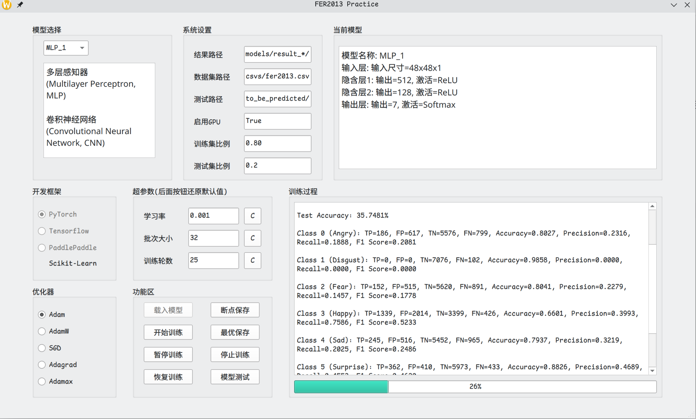
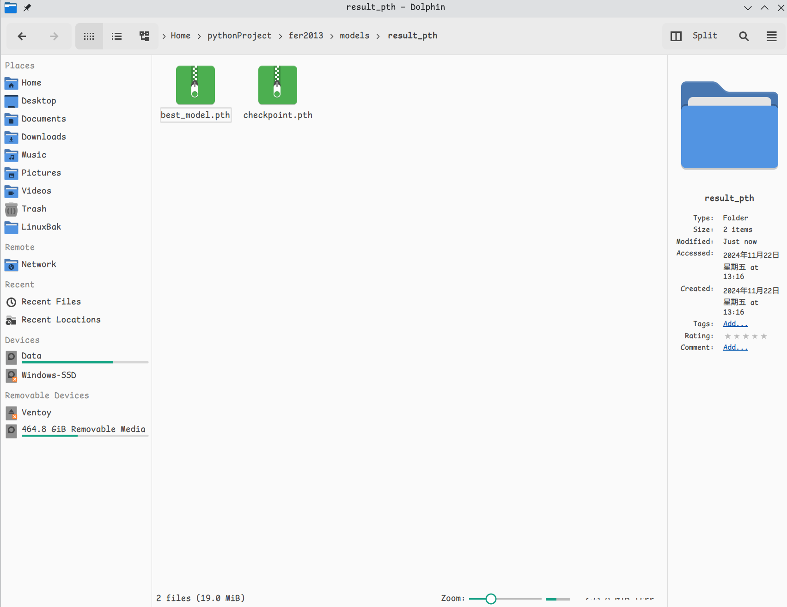
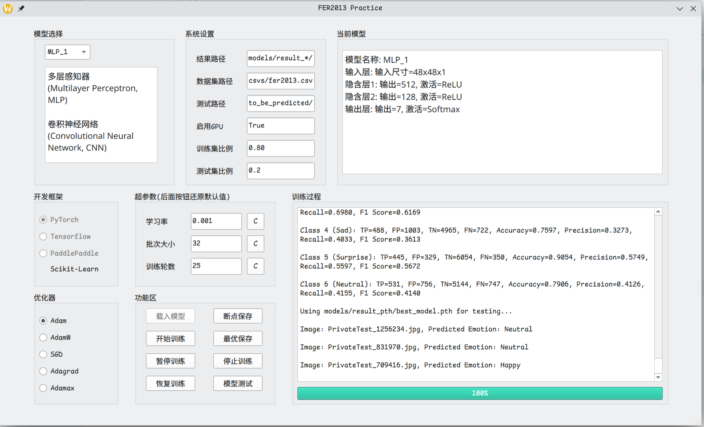
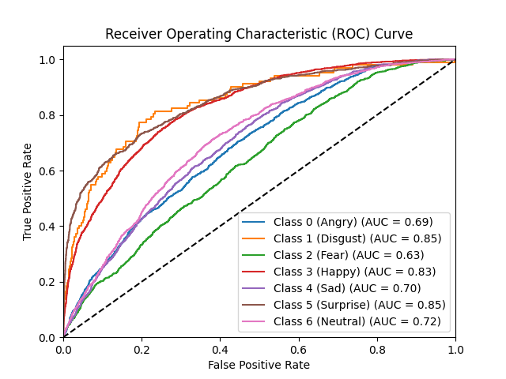

# FER2013训练项目

## 项目简介

本项目使用FER2013数据集进行训练，使用了`Pytorch`、`tensorflow`、`paddlepaddle`框架，实现了多个简单的神经网络模型，用于人脸表情识别。


## 开发环境

- Manjaro Linux KDE Linux 6.12.1-4-MANJARO
- Python 3.11
- Pytorch
- Tensorflow
- PaddlePaddle
- PyQt6
- Visual Studio Code
- Github Copilot

## 项目结构

```
--csvs # 数据集
    |--fer2013.csv
--imgs # README的图片
--models # 模型定义
    |--framework # 框架代码
        |--_pytorch.py
        |--_tensorflow.py
        |--_paddlepaddle.py
    |--models # 模型代码  
        |--_CNN.py
        |--_MLP.py
    |--result_h5 # tensorflow模型保存目录
    |--result_paddle # paddlepaddle模型保存目录
    |--result_pth # pytorch模型保存目录
    |--ROC # ROC曲线保存目录
--ROC # PreTrained.py文件保存ROC曲线的目录
--to_be_predicted # 待预测的图片文件夹
--ui # PyQt6界面代码
    |--fer2013_ui.py
    |--fer2013_ui.ui
--main.py # 主程序
--PreTrained.py # 使用预训练模型的Python程序，独立于主程序
    
```

## 使用前准备

### 安装依赖(以基于archlinux的系统为例)

> 下面的`torchenv`是一个Pytorch环境，可以根据自己的需要更改

```bash
yay -S miniconda3
/opt/miniconda3/bin/conda init zsh
conda create -n torchenv python=3.11 -y
conda activate torchenv
pip install pyqt6-tools pandas numpy tqdm pyinstaller jupyterlab notebook opencv-python scikit-learn matplotlib torch torchvision torchaudio
python3 -c "import torch; print(torch.cuda.is_available())"
```

如果环境为`tensorflow`或`paddlepaddle`，请自行安装对应的环境，从下面的命令中选择对应的`pip`命令

```bash
pip install pyqt6-tools pandas numpy tqdm pyinstaller jupyterlab notebook opencv-python scikit-learn matplotlib 'tensorflow[and-cuda]'

pip install pyqt6-tools pandas numpy tqdm pyinstaller jupyterlab notebook opencv-python scikit-learn matplotlib paddlepaddle-gpu
```

### 下载数据集

从[这里](https://www.kaggle.com/c/challenges-in-representation-learning-facial-expression-recognition-challenge/data)下载FER2013数据集，将`fer2013.csv`放入`csvs`文件夹中

## 预训练模型使用方法

### 使用预训练模型

```bash
conda activate torchenv
python PreTrained.py
```
### 代码说明

`PreTrained.py` 文件使用了预训练的 `ResNet-18` 模型来进行 `FER2013` 数据集的情感分类。以下是代码的主要部分和功能说明：

1. **数据集类**：
   - `FER2013Dataset`：自定义数据集类，用于加载 FER2013 数据集，并根据 `mode` 参数将数据集划分为训练集和测试集。

2. **数据增强和预处理**：
   - `transform_pytorch`：定义了数据增强和预处理操作，包括调整图像尺寸、随机水平翻转、随机旋转、颜色抖动、转换为张量和归一化。

3. **数据加载**：
   - 使用 `DataLoader` 加载训练集和测试集，分别存储在 `train_loader` 和 `test_loader` 中。

4. **预训练模型**：
   - `PretrainedModel`：定义了一个使用预训练 ResNet-18 模型的类，并将输入通道数修改为 1（灰度图像），输出类别数设置为 7（情感类别）。

5. **训练和评估函数**：
   - `train_model`：定义了模型的训练和评估函数，包括训练过程、损失计算、优化器更新、学习率调度、测试集评估、混淆矩阵计算和 ROC 曲线绘制。

6. **模型初始化和训练**：
   - 初始化 `PretrainedModel` 模型，并调用 `train_model` 函数进行训练和评估。

通过运行 `PreTrained.py` 文件，可以使用预训练的 ResNet-18 模型对 FER2013 数据集进行情感分类，并输出训练和测试结果。

## 项目主程序运行方法

> 这里为节省篇幅，不再叙述主程序代码，有需要可以查看项目文件

### 运行主程序

> 请根据自己的环境选择对应的`conda`环境，这里以`torchenv`为例

```bash
conda activate torchenv
python main.py
```
### 界面说明

- 左上角模型选择框：选择使用的模型，我们有MLP从1-4，CNN从1-4，共8个模型，右上角的当前模型文本框会显示当前选择的模型参数。
- 中间的系统设置可以自定义测试集的比例，默认为20%，训练集比例框会自动计算。
- 开发框架处，请务必选择当前环境支持的框架，默认为Pytorch。
- 超参数设置处可以自定义超参数，包括学习率、批大小、迭代次数等。
- 优化器选择框可以选择优化器，默认为Adam，可以选择SGD、Adagrad等。

### 功能区按钮说明


- 载入模型：根据选择的模型，设置的框架，测试集比例，超参数和优化器，载入模型。数据错误会提示错误重新输入，载入模型后，直到重新载入模型前，所有的参数都不可更改。
- 开始训练：训练模型，训练完成后会显示训练集和测试集的准确率，混淆矩阵（在训练过程文本框会显示训练过程，输出每个类别的TP、FP、TN、FN）以及测试准确率。
- 断点保存：点击后启用断点保存，训练过程一轮结束后中会保存模型，训练过程，混淆矩阵等信息，以便测试。
- 最优保存：点击后启用最优保存，训练过程中会保存测试集准确率最高的模型，以便测试。
- 模型测试：保存模型后，可以点击模型测试，确保在`to_be_predicted`文件夹中有待测试的图片，点击后会显示图片的预测结果。


## 实验报告

> 以下均在`torchenv`环境下进行
>
> 使用`tfenv`或`paddleenv`环境，请修改模型框架为对应环境

### 使用预训练模型(PreTrained.py)

先解释一下数据集处理

```python
class FER2013Dataset(Dataset):
    def __init__(self, csv_file, self_transform=None, mode='train', test_size=0.2):
        self.data = pd.read_csv(csv_file)
        self.transform = self_transform
        self.mode = mode  # 根据传入的 mode 参数设置模式

        # 将数据划分为训练集和测试集
        train_data, test_data = train_test_split(self.data, test_size=test_size, random_state=42, shuffle=True)
        self.train_data = train_data.reset_index(drop=True)
        self.test_data = test_data.reset_index(drop=True)
```
我们把测试集的比例设置为`20%`，使用`sklearn`的`train_test_split`函数进行划分。

我们的数据增强和预处理包括`调整尺寸`，`随机水平翻转`，`随机旋转`，`颜色抖动`，`转换为张量`和`归一化`。

```python
transform_pytorch = transforms.Compose([
    transforms.Resize((224, 224), interpolation=Image.BILINEAR),  # 调整图像尺寸为 224x224，使用双线性插值
    transforms.RandomHorizontalFlip(),
    transforms.RandomRotation(10),
    transforms.ColorJitter(brightness=0.2, contrast=0.2, saturation=0.2, hue=0.2),
    transforms.ToTensor(),
    transforms.Normalize(mean=[0.5], std=[0.5])
])
```

下面划分数据，批次大小为`32`，训练集为`train_loader`，测试集为`test_loader`。

```python
train_dataset = FER2013Dataset(csv_file=csv_file, self_transform=transform_pytorch, mode='train', test_size=0.2)
test_dataset = FER2013Dataset(csv_file=csv_file, self_transform=transform_pytorch, mode='test', test_size=0.2)

train_loader = DataLoader(train_dataset, batch_size=32, shuffle=True)
test_loader = DataLoader(test_dataset, batch_size=32, shuffle=False)
```

预训练模型定义及初始化如下（具体训练代码见`PreTrained.py`）：

我们使用 `models.resnet18(pretrained=True)` 加载预训练的 `ResNet-18` 模型，该模型在 ImageNet 数据集上进行了预训练，具有较强的特征提取能力。

我们将模型的第一个卷积层 `conv1` 的输入通道数修改为 1（灰度图像），以适应 FER2013 数据集的输入图像。原始的 ResNet-18 模型的第一个卷积层输入通道数为 3（RGB 图像）。

对于输出层，我们将模型的全连接层 `fc` 的输出类别数设置为 7（FER2013 数据集的情感类别数）。

```python
class PretrainedModel(nn.Module):
    def __init__(self, num_classes=7):
        super(PretrainedModel, self).__init__()
        self.model = models.resnet18(pretrained=True)
        self.model.conv1 = nn.Conv2d(1, 64, kernel_size=(7, 7), stride=(2, 2), padding=(3, 3), bias=False)
        self.model.fc = nn.Linear(self.model.fc.in_features, num_classes)

    def forward(self, x):
        return self.model(x)

# 初始化模型
model = PretrainedModel(num_classes=7)

# 训练和评估模型
train_model(model, train_loader, test_loader, num_epochs=100, learning_rate=0.001)
```
训练过程中，我们使用了`Adamax`优化器，学习率为`0.001`，训练了`100`个`epoch`，损失函数为`交叉熵`。

下面给出训练第92轮的结果

```bash
Epoch 92/100: 100%|█████████████████████████████████████████████████████████████████| 898/898 [01:49<00:00,  8.19batch/s]
Epoch 92/100, Loss: 0.2766, Accuracy: 90.2226%
Test Accuracy: 68.2781%
Class 0 (Angry): TP=595, FP=372, TN=5821, FN=390
Class 1 (Disgust): TP=68, FP=27, TN=7049, FN=34
Class 2 (Fear): TP=546, FP=393, TN=5742, FN=497
Class 3 (Happy): TP=1508, FP=216, TN=5197, FN=257
Class 4 (Sad): TP=718, FP=597, TN=5371, FN=492
Class 5 (Surprise): TP=614, FP=164, TN=6219, FN=181
Class 6 (Neutral): TP=852, FP=508, TN=5392, FN=426
Overall: Accuracy=68.2781%, Precision=0.6265, Recall=0.6667, F1 Score=0.6459
```

以及对应的`ROC`图像


可以看到这里的验证准确率为`68.2781%`，`F1 Score`为`0.6459`，`ROC`曲线显示的7条曲线分别代表7个类别的`ROC`曲线。基本上每一条曲线都在向左上角靠拢，说明预训练模型的效果还是不错的。

### 使用主程序(自定义模型)

> 这里不再说明具体代码，`models`文件里也有详细注释

> TP: 真正例, FP: 假正例, TN: 真负例, FN: 假负例

> 我们使用以下代码来输出类别
  ```python
   import pandas as pd

   # 加载数据集
   csv_file = 'fer2013.csv'
   data = pd.read_csv(csv_file)

   # 定义情绪标签
   emotion_labels = {
      0: "Angry",
      1: "Disgust",
      2: "Fear",
      3: "Happy",
      4: "Sad",
      5: "Surprise",
      6: "Neutral"
   }

   # 统计每个类别的样本数量
   class_counts = data['emotion'].value_counts().sort_index()
   class_counts.index = class_counts.index.map(emotion_labels)
   print(class_counts)
  ```
  输出结果如下
  ```bash
   emotion
   Angry       4953
   Disgust      547
   Fear        5121
   Happy       8989
   Sad         6077
   Surprise    4002
   Neutral     6198
   Name: count, dtype: int64
  ```
  可以看到数据集的不平衡性

#### MLP_1模型



我们先使用一个非常简单的模型来测试项目代码是否能正常运行，具体参数图中直接给出了。

```
模型名称: MLP_1
输入层: 输入尺寸=48x48x1
隐含层1: 输出=512, 激活=ReLU
隐含层2: 输出=128, 激活=ReLU
输出层: 输出=7, 激活=Softmax
```
可以看到，第一轮训练，第二个类别的`TP`和`FP`都为0，说明模型还未收敛，也侧面反应数据集的不平衡性。

测试`暂停训练`和`恢复训练`的按钮都能正常使用。

下面开启`断点保存`和`最优保存`，模型能够正常保存。



下面我们在`to_be_predicted`文件夹中放入几张图片，点击`模型测试`，可以看到图片的预测结果。




遗憾的是三张图片都预测错了，可能是模型不够复杂，或者测试图片太少。

下面是第25轮的输出

```bash
正在训练第 25 轮...

Epoch 25/25, Loss: 1.3149, Accuracy: 49.0752%

Test Accuracy: 44.4831%

Class 0 (Angry): TP=286, FP=513, TN=5680, FN=699, Accuracy=0.8312, Precision=0.3579, Recall=0.2904, F1 Score=0.3206

Class 1 (Disgust): TP=15, FP=16, TN=7060, FN=87, Accuracy=0.9857, Precision=0.4839, Recall=0.1471, F1 Score=0.2256

Class 2 (Fear): TP=196, FP=371, TN=5764, FN=847, Accuracy=0.8303, Precision=0.3457, Recall=0.1879, F1 Score=0.2435

Class 3 (Happy): TP=1232, FP=997, TN=4416, FN=533, Accuracy=0.7868, Precision=0.5527, Recall=0.6980, F1 Score=0.6169

Class 4 (Sad): TP=488, FP=1003, TN=4965, FN=722, Accuracy=0.7597, Precision=0.3273, Recall=0.4033, F1 Score=0.3613

Class 5 (Surprise): TP=445, FP=329, TN=6054, FN=350, Accuracy=0.9054, Precision=0.5749, Recall=0.5597, F1 Score=0.5672

Class 6 (Neutral): TP=531, FP=756, TN=5144, FN=747, Accuracy=0.7906, Precision=0.4126, Recall=0.4155, F1 Score=0.4140

Using models/result_pth/best_model.pth for testing...

Image: PrivateTest_1256234.jpg, Predicted Emotion: Neutral

Image: PrivateTest_831970.jpg, Predicted Emotion: Neutral

Image: PrivateTest_709416.jpg, Predicted Emotion: Happy
```

以及第25轮的`ROC`曲线



显然效果并不如预训练模型好，下面我们继续测试其他模型，看看到底能做得多好。

> 以下的模型我们直接上结果，需要时再详细说明

#### MLP_2模型